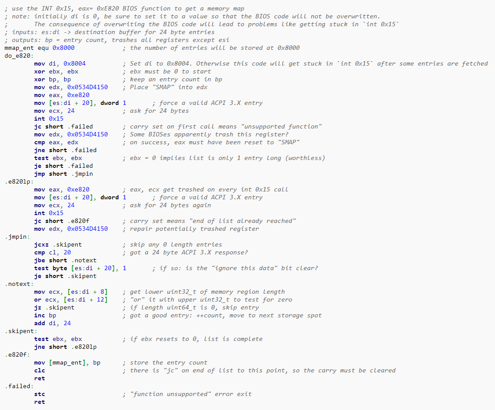

# Detecting Memory x86
https://wiki.osdev.org/Detecting_Memory_%28x86%29

## Background
One of the most vital pieces of information that an OS needs in order to initialize itself is **a map of the available RAM** on a machine. Fundamentally, the best way an OS can get that information is **by using the BIOS**.

There may be rare machines where you have no other choice but to try to detect memory yourself -- however, doing so is **unwise** in any other situation.

It is perfectly reasonable to say to yourself, "How does the BIOS detect RAM? I'll just do it that way." Unfortunately, the answer is disappointing:
**Most BIOSes can't use any RAM until they detect the type of RAM installed**, then detect the size of each memory module, then configure the chipset to use the detected RAM.

All of this depends on chipset specific methods, and is usually documented in the datasheets for the memory controller (northbridge). **The RAM is unusable for running programs during this process**. The BIOS initially is running from ROM, so it can play the necessary games with the RAM chips. But it is completely impossible to do this from inside any other program.

It is also reasonable to wish to reclaim the memory from 0xA0000 to 0xFFFFF and make your RAM contiguous. Again the answer is disappointing:


## Detecting Upper Memory
## BIOS Function: INT 0x15, EAX = 0xE820

By far **the best way** to detect the memory of a PC is by using the INT 0x15, EAX = 0xE820 command. 

It is the only BIOS function that can detect memory areas above 4G. It is meant to be the ultimate memory detection BIOS function.

In reality, **this function returns an unsorted list** that may contain unused entries and (in rare/dodgy cases) may return overlapping areas. Each list entry is **stored in memory at ES:DI, and DI is not incremented** for you.

The format of an entry is 2 uint64_t's and a uint32_t in the 20 byte version, plus one additional uint32_t in the 24 byte ACPI 3.0 version (but nobody has ever seen a 24 byte one). It is probably best to always store the list entries as 24 byte quantities -- to preserve uint64_t alignments, if nothing else. (Make sure to set that last uint64_t to 1 before each call, to make your map compatible with ACPI).
#### Data structure
- First uint64_t = Base address
- Second uint64_t = Length of "region" (if this value is 0, ignore the entry)
- Next uint32_t = Region "type"
    - Type 1: Usable (normal) RAM
    - Type 2: Reserved - unusable
    - Type 3: ACPI reclaimable memory
    - Type 4: ACPI NVS memory
    - Type 5: Area containing bad memory
- Next uint32_t = ACPI 3.0 Extended Attributes bitfield (if 24 bytes are returned, instead of 20)
    - Bit 0 of the Extended Attributes indicates if the entire entry should be ignored (if the bit is clear). This is going to be a huge compatibility problem because most current OSs won't read this bit and won't ignore the entry.
    - Bit 1 of the Extended Attributes indicates if the entry is non-volatile (if the bit is set) or not. The standard states that "Memory reported as non-volatile may require characterization to determine its suitability for use as conventional RAM."
    - The remaining 30 bits of the Extended Attributes are currently undefined.

#### Notes:
- After getting the list, it may be desirable to: sort the list, combine adjacent ranges of the same type, change any overlapping areas to the most restrictive type, and change any unrecognised "type" values to type 2.
- Type 3 "ACPI reclaimable" memory regions may be used like (and combined with) normal "available RAM" areas as long as you're finished using the ACPI tables that are stored there (i.e. it can be "reclaimed").
- Types 2, 4, 5 (reserved, ACPI non-volatile, bad) mark areas that should be avoided when you are allocating physical memory.
Treat unlisted regions as Type 2 -- reserved.
- Your code must be able to handle areas that don't start or end on any sort of "page boundary".

#### Output sample:
```
Base Address       | Length             | Type  
0x0000000000000000 | 0x000000000009FC00 | Free Memory (1)  
0x000000000009FC00 | 0x0000000000000400 | Reserved Memory (2)  
0x00000000000E8000 | 0x0000000000018000 | Reserved Memory (2)  
0x0000000000100000 | 0x0000000001F00000 | Free Memory (1)  
0x00000000FFFC0000 | 0x0000000000040000 | Reserved Memory (2)  
```

### Basic usage
- For the first call to the function, point **ES:DI** at the destination buffer for the list. 
- Clear EBX. 
- Set EDX to the magic number 0x534D4150. 
- Set EAX to 0xE820 (note that the upper 16-bits of EAX should be set to 0). 
- Set ECX to 24. 
- Do an INT 0x15.
- If the first call to the function is successful, EAX will be set to 0x534D4150, and the Carry flag will be clear. 
- EBX will be set to some non-zero value, which must be preserved for the next call to the function. 
- CL (CX_low) will contain the number of bytes actually stored at ES:DI (probably 20).
- For the subsequent calls to the function: increment DI by your list entry size, reset EAX to 0xE820, and ECX to 24. 
- When you reach the end of the list, EBX may reset to 0. 
- If you call the function again with EBX = 0, the list will start over. 
- If EBX does not reset to 0, the function will return with Carry set when you try to access the entry after the last valid entry.

### Sample code

