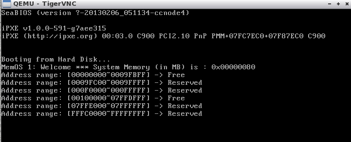
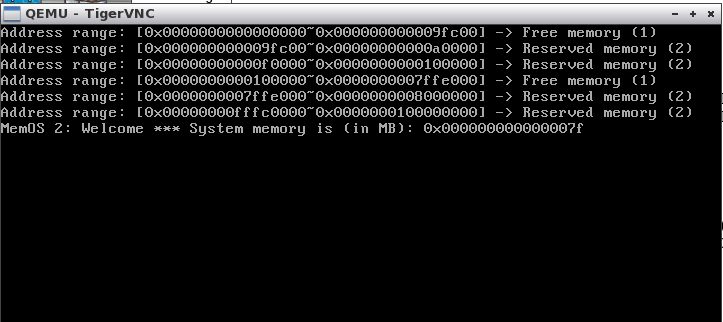

# MemOS-Simple-Memory-System
Bootstrap a program that probes the system BIOS and reports the amount of physical memory available in your machine.

## Memos1
The purpose of memos1 is to probe the memory by using assembly MBR code in memos1.s, in which we call BIOS interrupt INT 15 with AX=0xE802 to do the job.
- disk1.img is the virtual disk. We insert our code in this disk and boot it.
- memos1.ld is the linker script.

## Memos2
Use grub to probe physical memory in protected mode.

