# Lab 3: Virtual Disk and Grub
## Preliminaries
Tasks for today:
1. Build a virtual disk
2. Install Grub onto the virtual disk

## Virtual Disk
* Disk = An array of sectors
* Disk size = number of sectors * size of sector (512 bytes)

To view disk partition: 
```
$ sudo fdisk -l /dev/sda
```
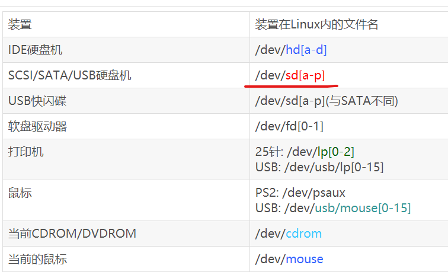
* virtual disk = a piece of the real disk
* So how to create a virtual disk?
### Step 1: Use echo to create a virtual disk, mydisk.img
Create a file called disk.img with size of 1kB*32760, filled with null character.
```
dd if=/dev/zero of=disk.img bs=1k count=32760
```
where **bs** is the block size.

**dd** is a command-line utility, the primary purpose of which is to **convert and copy files**.

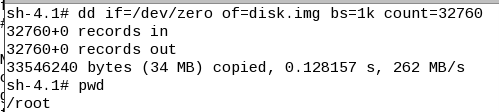

#### What is /dev/zero?
/dev/zero is a special file in Unix-like operating systems that **provides as many null characters (ASCII NUL, 0x00) as are read from it**. One of the typical uses is to **provide a character stream for initializing data storage**.

* I wrote something into the disk? Next time, how am I gonna find the thing I wrote?
* Need some place to store the bookkeeping data
* What is the layout of the contents in the disk?
* partition table:
```
$ sudo fdisk -l /dev/sda 
```
*  what about mydisk.img?
* Before creating partitions: 
```
hexdump mydisk.img
```
A hex dump is a hexadecimal view (on screen or paper) of computer data, from RAM or from a computer file or storage device.
* Now give mydisk.img some partitions: 
```
fdisk mydisk.img
```
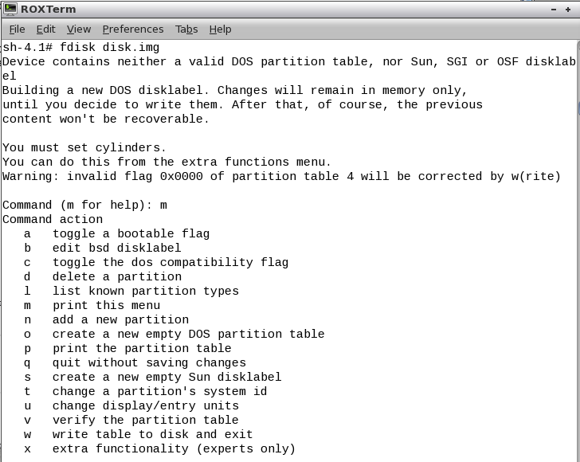

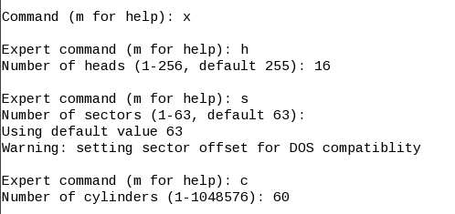

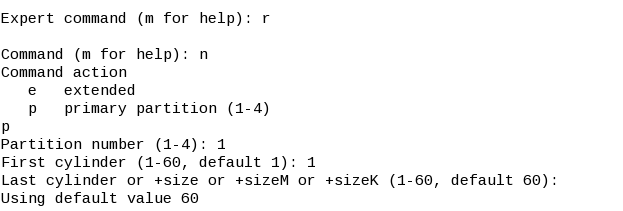

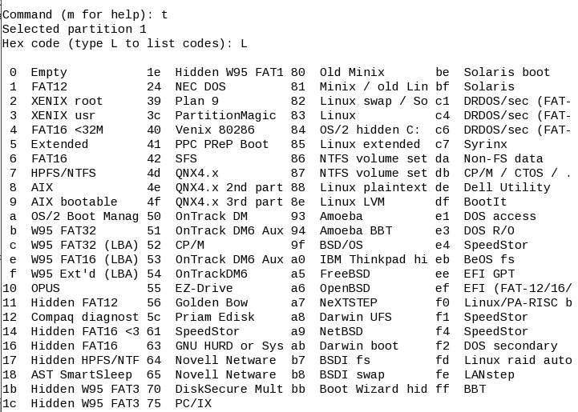

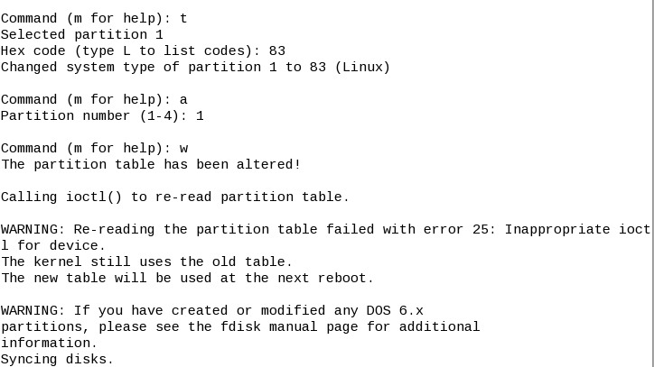

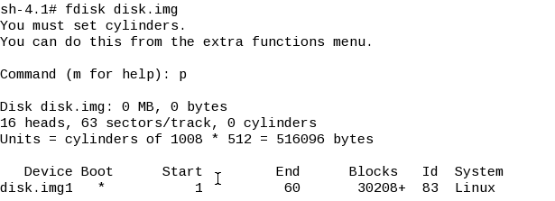

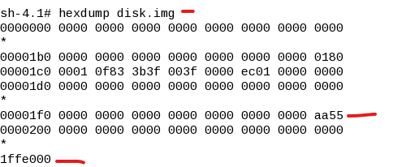

* Create one big partition on the entire disk. hexdump again. What has been overwritten?
* What about want a second partition?
* Format the first partition to ext2: 
```
mkfs.ext2 mydisk.img
```
Create an actual filesystem on the partition in the disk image (NOTE: here, we'll create an ext2 native Linux file system using mke2fs).

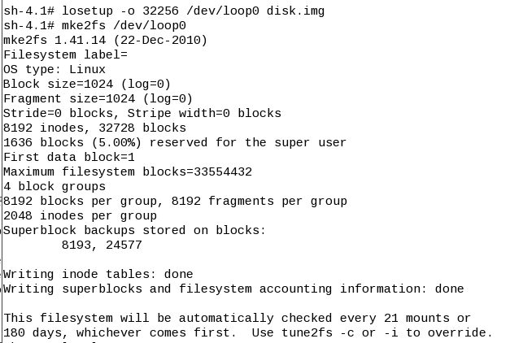
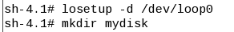
* Only partition has file system: verifiy it by 
```
$ mount
```
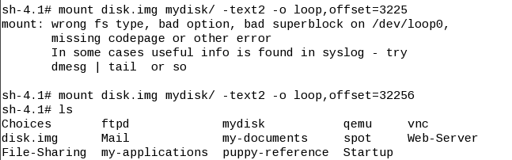

* How to format a partition in a virtual disk -- how to format a real partition
* Expose partition as a device: 
```
losetup /dev/loop0 mydisk.img
```
```
losetup -o [offset] /dev/loop0 mydisk.img
```
* Now to the kernel, loop0 is a real partition
Now format loop0, mount loop0, write a file (again, to the kernel, it is a real fs/partition). hexdump again. umount, losetup -d

## Grub
* When reading a file, fs kernel code runs to read from the disk
* Kernel image is a file in /boot
* Chicken and egg problem: when booting kernel, who reads kernel image from disk
* Reserve the first sector: MBR. How to put fs code into MBR?
* Find fs code in grub
* Install grub to MBR
* In puppy, mount the partition
```
mkdir -p boot/grub
```
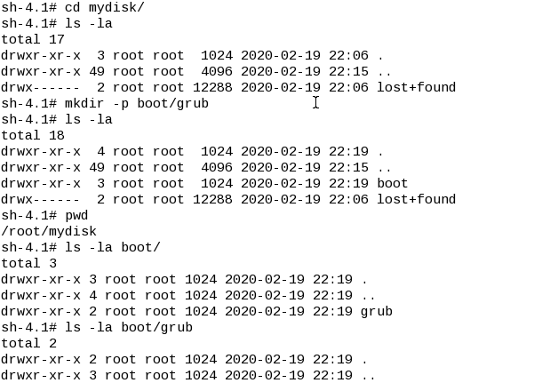
* copy over files /boot/grub
```
$ cp /boot/grub/stage* ./boot/grub/
$ cp /boot/grub/e2fs_stage1_5 ./boot/grub/
```
```
$grub
```
```
device (hd0) /path/to/disk.img
root (hd0,0)
setup (hd0)
```
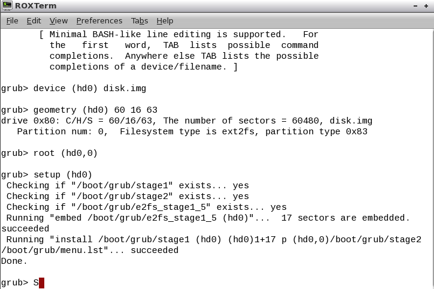
* test it out: 
```
qemu-system-i386 -hda disk.img -vnc :1
```

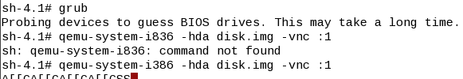
* Open another terminal
```
cd /root/vnc/opt/TigerVNC/bin/
./vncviewer :1
```
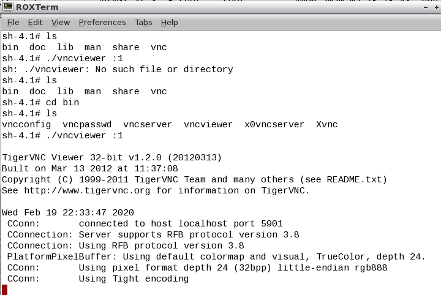
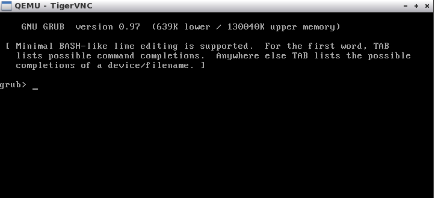
***


## A HelloWorld Assembly Code

What is a partition?

```
losetup -o 32256 /dev/loop0 disk.img
```
Where do we get 32256 the first cylinder? 

What is loop0?

hd0: hard disk 0

Install grub...