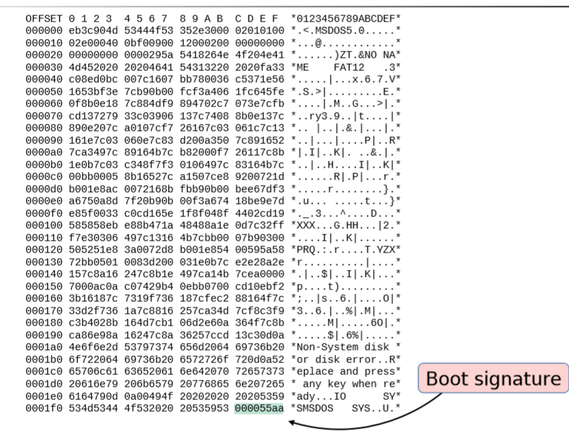
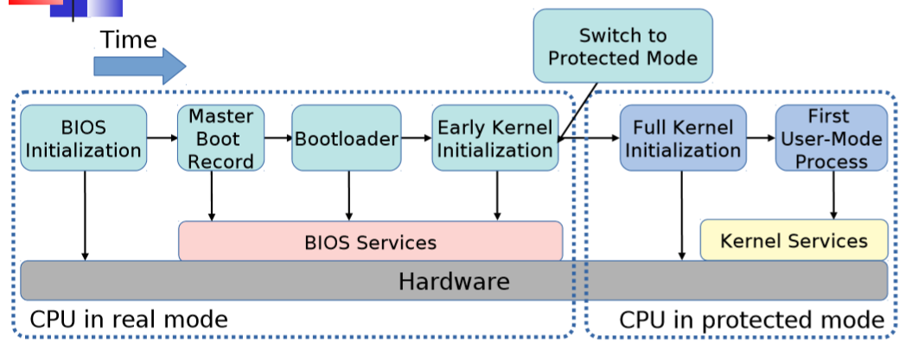
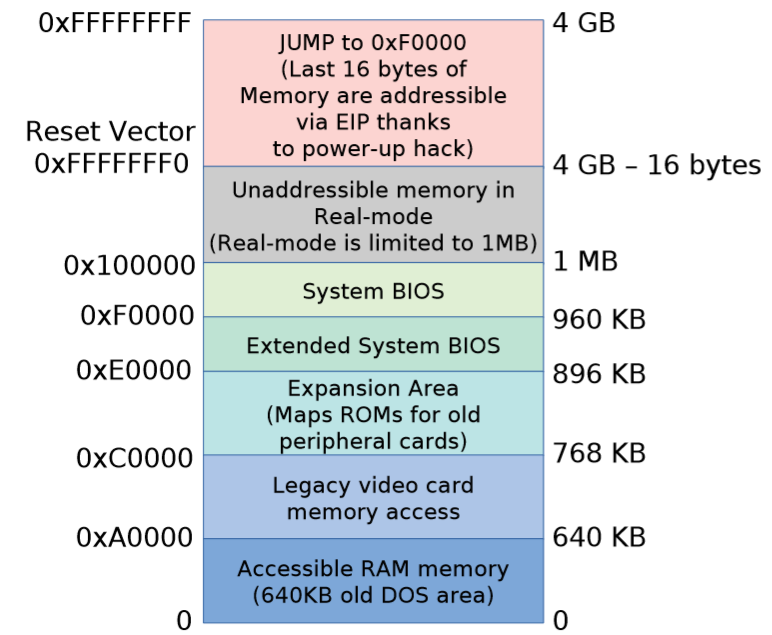
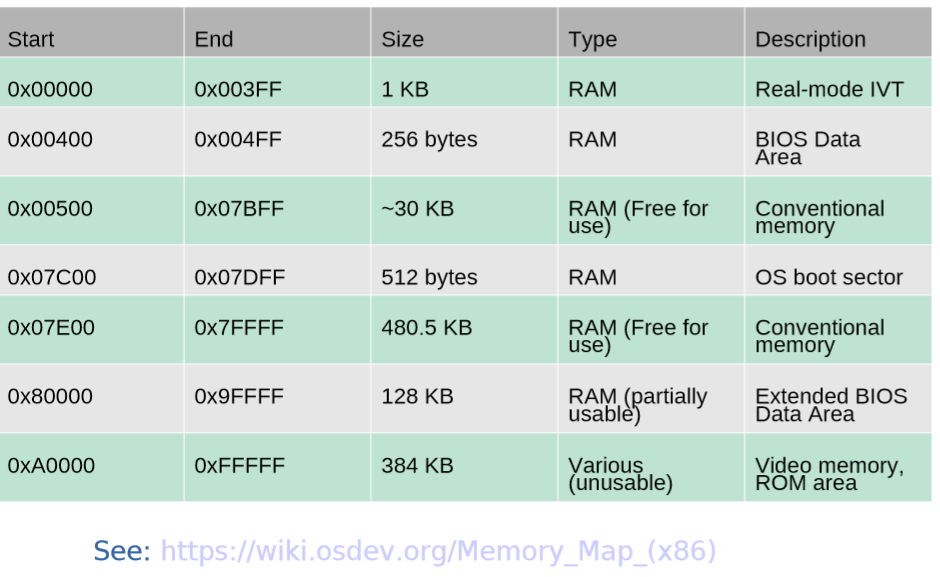

# Booting

# Lecture Slide
By Rich West at Boston University.

## Bootstrap program --- Initial program runs when system starts
* Initializes system, CPU registers, memory, devices… 
*  Loads OS kernel into main memory. 
   * E.g. GRUB, LILO, Das U-Boot, etc.
* OS then executes 1st process (in UNIX/Linux this is typically “init”) and then waits for events to occur.
*  Events -> interrupts
   * Hardware interrupts from devices to CPU.
   * Software interrupts, or traps, via syscalls and/or faults.

## The "Old" PC Disk Boot Sector
**PC architecture assumes boot sector (or MBR) is 1st sector (S) on 1st track of a cylinder (C), under the first head (H).**

* CHS geometry: 001 = logical block address (LBA) 0 
* For CHS block address, 
$$LBA = (C \times heads+H) \times sectors/track + (S-1)$$
* At power on, the BIOS performs a power-on self-test (or POST) 
  * 80386: CPU starts executing BIOS at 0xF000:FFF0.
  * Modern x86: Starts reset vector at 0xFFFFFFF0 then jumps to 0xF0000 
  * Drives (e.g., floppy, disk, cd-rom) are checked for a valid boot sector having **a signature 0AA55h at offset 510**.
  * NOTE: Sectors are 512 bytes.
*  BIOS reads valid boot sector **from disk into memory** at address **0:7C00h**.
* Boot sector code + data can then load kernel.

## Example DOS Boot Sector

## BIOS Booting Procedure

**Example BIOS functions using real-mode s/w interrupts:**
* **INT 0x10** = Video display functions (including VESA/VBE) 
* INT 0x13 = mass storage (disk, floppy) access 
* INT 0x15 = memory size functions 
* INT 0x16 = keyboard functions 

## 32-bit PC Memory Regions in Boot Procedure

## x86 Memory Map (Lower 1MB)

