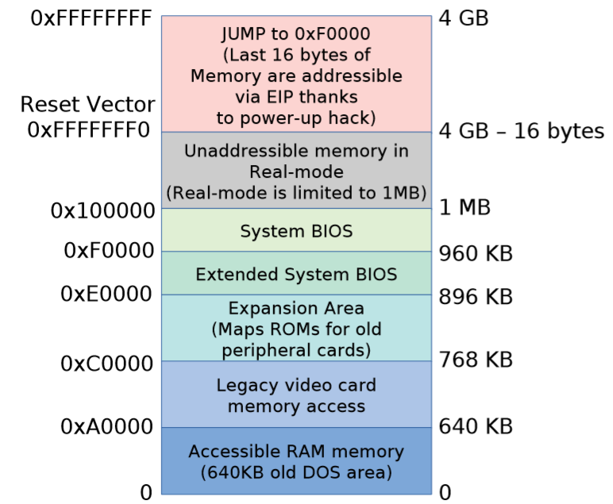
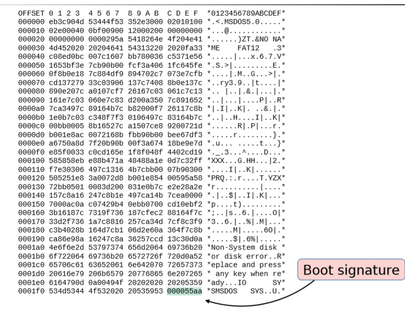
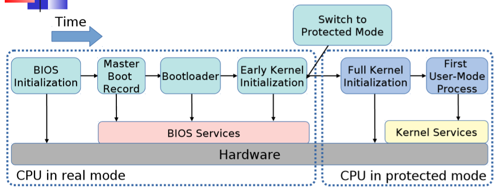
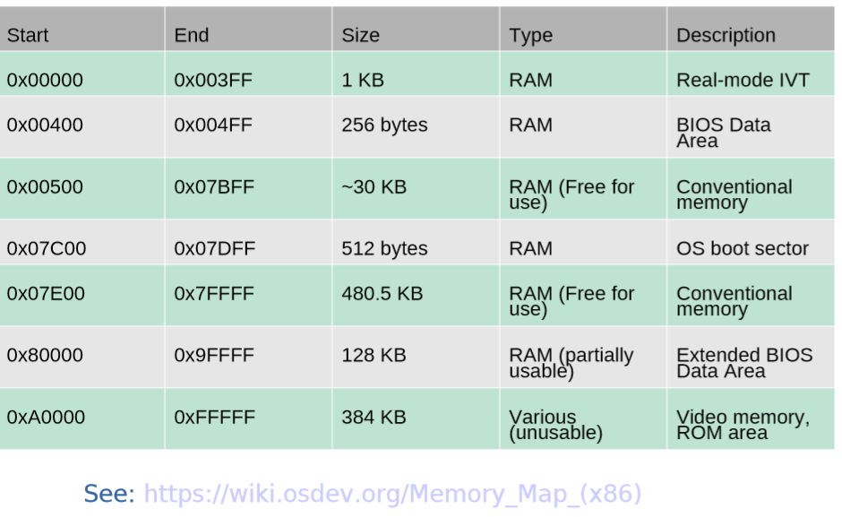

# Booting
Booting is the process of starting a computer.

按下开机键时，存储在硬盘的操作系统是如何装载入内存，控制权是如何交接给操作系统的。

## Reference
https://en.wikipedia.org/wiki/Booting
https://www.cs.rutgers.edu/~pxk/416/notes/02-boot.html

## Booting Procedure

1. An IA–32-based computer is expected to have a **BIOS** (Basic Input/Output System, which comprises the bootloader firmware) in non-volatile memory, typically ROM. 

   * BIOS is firmware used to perform **hardware initialization** during the booting process (power-on startup), and to provide runtime services for operating systems and programs.

   * The BIOS is a descendent of the BIOS found on early CP/M systems in that it contains low-level functions for **accessing some basic system devices**, such as performing disk I/O, reading from the keyboard, and accessing the video display. It also contains code to load a **stage 1 boot loader**.

2. When the **CPU** is reset at startup, the computer **starts execution at memory location 0xFFFF0** (the IA–32 architecture uses a segment:offset form of addressing; the code segment is set to 0xF000 and the instruction pointer is set to 0xFFF0)**(CS:IP=0xF000:0xFFF0)**.
3. The processor starts up in **real mode**, which gives it access to only a **20-bit memory address** space and provides it with **direct access to I/O, interrupts, and memory**.
   * The location at 0xFFFF0 is actually **at the end of the BIOS ROM** and contains a **jump instruction** to a region of the BIOS **that contains start-up code**. 
   * 注意，这时候BIOS已经装入内存了，CPU指向内存的0xFFFF0,也就是如图System BIOS这个区域，这里装着一条跳转指令，跳到BIOS程序的入口点。因为有的BIOS的程序大小不一样，所以有Extended System BIOS这个区域。

4. Upon start-up, the BIOS goes through the following sequence:
   1. Power-on self-test (POST). 上电自检。
   2. Detect the video card’s (chip’s) BIOS and execute its code to initialize the video hardware. 
   3. Detect any other device BIOSes and invoke their initialize functions. 
   4. Display the BIOS start-up screen.
   5. Perform a brief memory test (identify how much memory is in the system). 内存检测。
   6. Set memory and drive parameters. 
   7. Configure Plug & Play devices (traditionally PCI bus devices).
   8. Assign resources (DMA channels & IRQs).
   9. Identify the boot device.

5. When the BIOS identifies the boot device (typically one of several disks that has been tagged as the bootable disk), it reads block 0 from that device into memory location **0x7c00** and jumps there.

## Stage 1: the Master Boot Record
This **first disk block, block 0**, is called the **Master Boot Record (MBR)** and contains the first stage boot loader. Since the standard block size is **512 bytes**, the entire boot loader has to fit into this space. The contents of the MBR are:

- First stage boot loader (≤ 446 bytes)
- Disk signature (2 bytes) **0x55AA**
- Disk partition table, which identifies distinct regions of the disk (16 bytes per partition × 4 partitions = 64 bytes)

## Stage 2: the Volume Boot Record
Once the BIOS **transfers control** to the start of the MBR that was loaded into memory, the MBR code scans through its partition table and loads the **Volume Boot Record (VBR)** for that partition. The VBR is a sequence of **consecutive blocks starting at the first disk block of the designated partition**. The first block of the VBR identifies the partition type and size and contains an **Initial Program Loader (IPL)**, which is code that will load the additional blocks that comprise the **second stage boot loader**. On Windows NT-derived systems (e.g., Windows Server 2012, Windows 8), the IPL loads a program called NTLDR, **which then loads the operating system**.

# Lecture Slide
By Rich West at Boston University.

## Bootstrap program --- Initial program runs when system starts
* Initializes system, CPU registers, memory, devices… 
*  Loads OS kernel into main memory. 
   * E.g. GRUB, LILO, Das U-Boot, etc.
* OS then executes 1st process (in UNIX/Linux this is typically “init”) and then waits for events to occur.
*  Events -> interrupts
   * Hardware interrupts from devices to CPU.
   * Software interrupts, or traps, via syscalls and/or faults.

## The "Old" PC Disk Boot Sector
**PC architecture assumes boot sector (or MBR) is 1st sector (S) on 1st track of a cylinder (C), under the first head (H).**

* CHS geometry: 001 = logical block address (LBA) 0 
* For CHS block address, 
$$LBA = (C \times heads+H) \times sectors/track + (S-1)$$
* At power on, the BIOS performs a power-on self-test (or POST) 
  * 80386: CPU starts executing BIOS at 0xF000:FFF0.
  * Modern x86: Starts reset vector at 0xFFFFFFF0 then jumps to 0xF0000 
  * Drives (e.g., floppy, disk, cd-rom) are checked for a valid boot sector having **a signature 0AA55h at offset 510**.
  * NOTE: Sectors are 512 bytes.
*  BIOS reads valid boot sector **from disk into memory** at address **0:7C00h**.
* Boot sector code + data can then load kernel.

## Example DOS Boot Sector

## BIOS Booting Procedure

**Example BIOS functions using real-mode s/w interrupts:**
* **INT 0x10** = Video display functions (including VESA/VBE) 
* INT 0x13 = mass storage (disk, floppy) access 
* INT 0x15 = memory size functions 
* INT 0x16 = keyboard functions 

## 32-bit PC Memory Regions in Boot Procedure

## x86 Memory Map (Lower 1MB)

